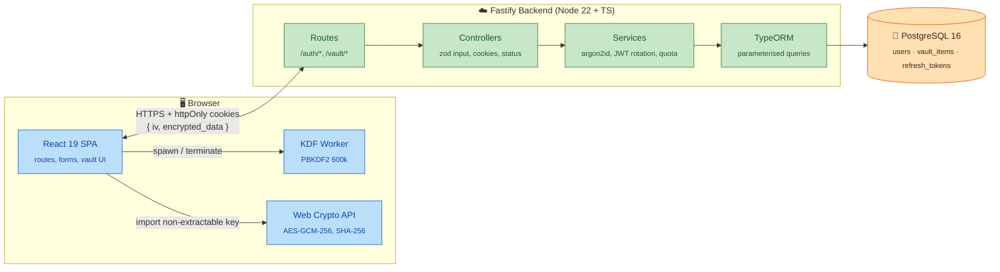
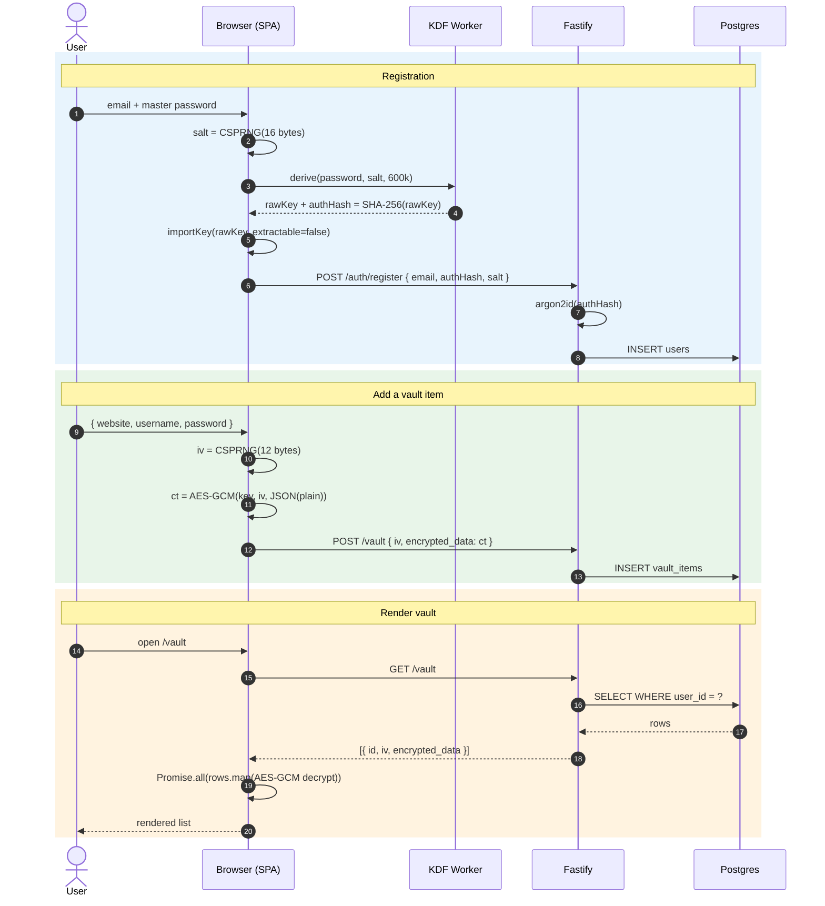
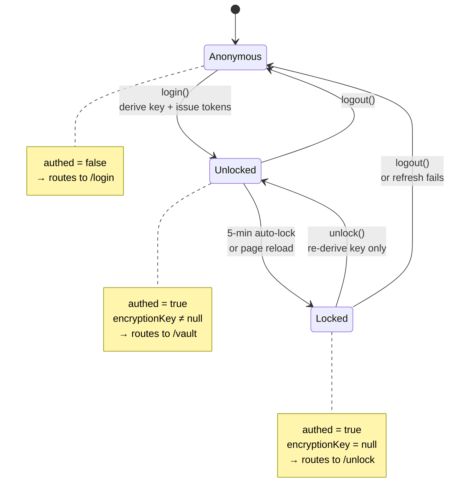
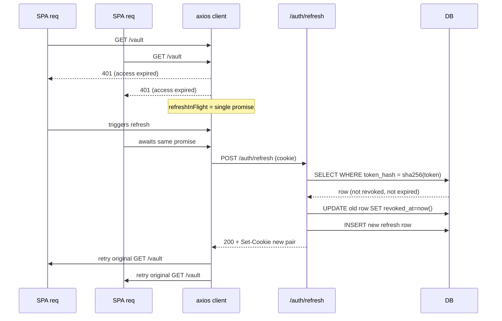

# ZeroTrust

A zero-knowledge password manager. The browser is the only party that can read your vault — all encryption happens client-side with the Web Crypto API, and the server only ever stores opaque `{ iv, encrypted_data }` blobs. A database leak yields random bytes, not credentials.

## Functionalities

- **Account registration** — master password is stretched with PBKDF2-SHA-256 (600k iterations) in a Web Worker; only a one-way SHA-256 of the derived key (`authHash`) leaves the browser. The server then runs argon2id over `authHash` before storing it.
- **Login + unlock** — fetch the user's salt, re-derive the same AES-256-GCM key locally, prove possession via `authHash`. After 5 minutes idle (or a page reload) the key is wiped from React state; the user can `/unlock` with just the master password — no full login round-trip.
- **Vault CRUD** — list / create / update / delete encrypted items. Each item is `AES-GCM-256({website, username, password})` with a fresh 12-byte IV per encryption. The server never sees plaintext.
- **Session management** — short-lived JWT (15 min) in an `httpOnly; SameSite=Strict; Secure` cookie. Opaque refresh tokens are rotated on every refresh and stored SHA-256-hashed server-side, so a DB leak doesn't expose a replayable credential. Single-flight refresh on the client dedupes concurrent 401s.
- **Defence-in-depth** — argon2id at rest, dummy-hash timing-attack mitigation on login, per-route rate limiting on `/auth/*`, CSP/HSTS/XFO via `@fastify/helmet`, CORS pinned to a single origin, zod schemas at every HTTP boundary.

## High-Level Design

### System architecture



### Zero-knowledge encryption pipeline



### Auth session state machine



### Refresh-token rotation (single-flight)



## Wireframes

```
┌────────────────────────────────────────┐   ┌────────────────────────────────────────┐
│  ZeroTrust — Log in                    │   │  ZeroTrust — Register                  │
├────────────────────────────────────────┤   ├────────────────────────────────────────┤
│                                        │   │                                        │
│  Email                                 │   │  Email                                 │
│  ┌──────────────────────────────────┐  │   │  ┌──────────────────────────────────┐  │
│  │ user@example.com                 │  │   │  │ user@example.com                 │  │
│  └──────────────────────────────────┘  │   │  └──────────────────────────────────┘  │
│                                        │   │                                        │
│  Master password                       │   │  Master password (≥ 12 chars, mixed)   │
│  ┌──────────────────────────────────┐  │   │  ┌──────────────────────────────────┐  │
│  │ ••••••••••••                     │  │   │  │ ••••••••••••                     │  │
│  └──────────────────────────────────┘  │   │  └──────────────────────────────────┘  │
│                                        │   │  Strength: ████████░░  Strong          │
│  ┌──────────────────────────────────┐  │   │                                        │
│  │              Log in              │  │   │  ┌──────────────────────────────────┐  │
│  └──────────────────────────────────┘  │   │  │           Create account         │  │
│                                        │   │  └──────────────────────────────────┘  │
│  No account?  Register →               │   │                                        │
└────────────────────────────────────────┘   └────────────────────────────────────────┘

┌────────────────────────────────────────┐   ┌────────────────────────────────────────┐
│  ZeroTrust — Unlock                    │   │  ZeroTrust — Vault           [+ Add]   │
├────────────────────────────────────────┤   ├────────────────────────────────────────┤
│                                        │   │  Search   ┌────────────────────────┐   │
│  Welcome back, user@example.com        │   │           │ github                 │   │
│                                        │   │           └────────────────────────┘   │
│  Master password                       │   │                                        │
│  ┌──────────────────────────────────┐  │   │  ┌──────────────────────────────────┐  │
│  │ ••••••••••••                     │  │   │  │ github.com                       │  │
│  └──────────────────────────────────┘  │   │  │ alice@example.com    [👁] [📋]   │  │
│                                        │   │  │ ••••••••••           [✎]  [🗑]   │  │
│  ┌──────────────────────────────────┐  │   │  ├──────────────────────────────────┤  │
│  │              Unlock              │  │   │  │ aws.amazon.com                   │  │
│  └──────────────────────────────────┘  │   │  │ alice                [👁] [📋]   │  │
│                                        │   │  │ ••••••••••           [✎]  [🗑]   │  │
│  Sign in as a different user →         │   │  └──────────────────────────────────┘  │
│                                        │   │                                        │
│                                        │   │  Auto-lock in 4:32                     │
└────────────────────────────────────────┘   └────────────────────────────────────────┘
```

## Local setup

### Prerequisites

- Node.js **22+** and npm
- Either Docker (recommended — the compose file handles Postgres) **or** a local Postgres 16

### Quick start — Docker Compose

Brings up Postgres + the backend (with migrations run automatically on boot) in one command. Run from the repo root:

```bash
# 1. One-time: create your env file and fill in the two required secrets.
cp .env.example .env
# Generate a strong secret and append it to .env:
echo "JWT_SECRET=$(openssl rand -base64 48)" >> .env
echo "POSTGRES_PASSWORD=$(openssl rand -base64 24)" >> .env
# (open .env to remove the empty placeholder lines if you prefer)

# 2. Start the stack.
docker compose up --build
```

What happens:

1. Postgres comes up and reports healthy via `pg_isready`.
2. The backend container starts, opens the connection pool, runs any pending migrations (`AppDataSource.runMigrations()` in [Backend/src/index.ts](Backend/src/index.ts)), then listens on `:3000`.
3. The compose file fails fast if `JWT_SECRET` or `POSTGRES_PASSWORD` are missing — no silent insecure defaults.

Health check:

```bash
curl -i http://localhost:3000/health
# → 200 OK { "status": "ok" }
```

Then start the frontend on the host (see below) — the SPA is not in the compose stack so HMR keeps working during development.

### Frontend (run from `Frontend/`)

```bash
cd Frontend
cp .env.example .env       # sets VITE_API_BASE_URL=http://localhost:3000
npm install
npm run dev                # http://localhost:5173
```

Other scripts:

| Command          | What it does                                                   |
| ---------------- | -------------------------------------------------------------- |
| `npm run build`  | `tsc -b && vite build` — fails on type errors.                 |
| `npm run lint`   | Flat-config ESLint over `**/*.{ts,tsx}`.                       |
| `npm run preview`| Serves the production build locally.                           |
| `npm test`       | `vitest run` (no test files yet — adding one creates the dir). |

### Backend without Docker (run from `Backend/`)

Use this if you'd rather run Postgres directly on the host (e.g. Postgres.app, Homebrew).

```bash
cd Backend
cp .env.example .env       # set DATABASE_URL and JWT_SECRET (>=32 chars)
npm install
npm run dev                # tsx watch src/index.ts → http://localhost:3000
```

The backend runs migrations on every boot, so the first start initialises the schema. Other scripts:

| Command             | What it does                                               |
| ------------------- | ---------------------------------------------------------- |
| `npm run build`     | `tsc -p tsconfig.build.json` → `./dist`.                   |
| `npm start`         | `node dist/index.js` — requires a prior `build`.           |
| `npm run typecheck` | `tsc --noEmit` — the pre-push gate (no CI today).          |
| `npm test`          | `vitest run` (config globs `tests/**/*.test.ts`).          |

## Project layout

```
ZeroTrust/
├── Backend/                Node + TS + Fastify + TypeORM
│   ├── src/
│   │   ├── index.ts        Composition root (plugins + error handler + boot)
│   │   ├── config.ts       zod-validated env vars; process.exit(1) on bad config
│   │   ├── data-source.ts  TypeORM DataSource (static entity + migration list)
│   │   ├── routes/         URL → controller wiring, per-route rate limits
│   │   ├── controllers/    HTTP adapter (cookies, status, zod parse)
│   │   ├── services/       Business logic (argon2id, JWT rotation, vault quota)
│   │   ├── schemas/        zod request schemas (side-effect-free)
│   │   ├── entities/       TypeORM mappings
│   │   ├── migrations/     Numbered, hand-written SQL
│   │   ├── errors/         Typed AppError hierarchy
│   │   └── types.d.ts      Fastify + @fastify/jwt module augmentation
│   ├── Dockerfile          Multi-stage build (node:22-alpine)
│   └── vitest.config.ts
├── Frontend/               React 19 + Vite + TS
│   └── src/
│       ├── api/            Axios facade + AuthApi / VaultApi (Repository pattern)
│       ├── features/
│       │   ├── auth/{pages,context}/
│       │   └── vault/{pages,components,hooks}/
│       └── shared/
│           ├── components/ Toast, ErrorBoundary, ConfirmDialog, ...
│           ├── hooks/      useAutoLock, useClipboardWithClear
│           ├── utils/      crypto.ts, passwordPolicy.ts
│           └── worker/     kdf.worker.ts (PBKDF2 in a Worker)
├── docker-compose.yml      db + backend, healthcheck-gated
├── .env.example            Root env template (used by docker compose)
├── CLAUDE.md               Architecture notes for AI agents
└── README.md
```

## Security notes

- **Master password and AES key never leave the browser.** The server only ever sees `authHash` (a one-way hash of the key) and the AES-GCM ciphertexts.
- **No secrets in localStorage / sessionStorage / URLs.** The encryption key lives only in React state and is wiped on auto-lock or reload.
- **httpOnly + SameSite=Strict + Secure cookies in production.** Refresh cookies are path-scoped to `/auth` so the vault handlers never see them.
- **Rotating refresh tokens** are stored SHA-256-hashed; presenting a revoked token raises `UnauthorizedError`.
- **Rate limits**: 5 req/min/IP on `/auth/register` and `/auth/login`, 30 req/min/IP on `/auth/salt` and `/auth/refresh`, 100 req/min/IP globally. In-memory store — swap to redis before scaling horizontally so the limits stay coherent across replicas.
- **Helmet** sets CSP, HSTS, X-Content-Type-Options, X-Frame-Options, Referrer-Policy on every reply.
- **Error responses are generic.** Stack traces and DB errors never reach the client; the server logs the full error with cookies/`authorization`/`auth_hash`/`encrypted_data` redacted.
